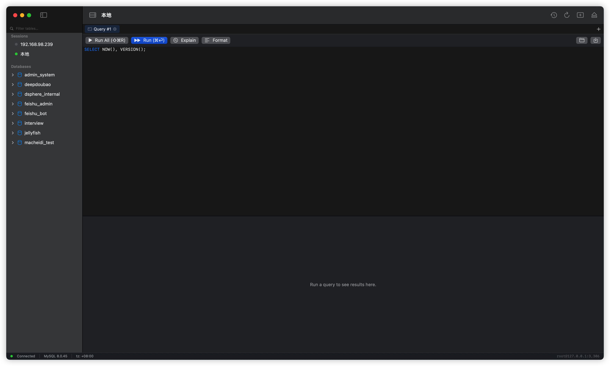
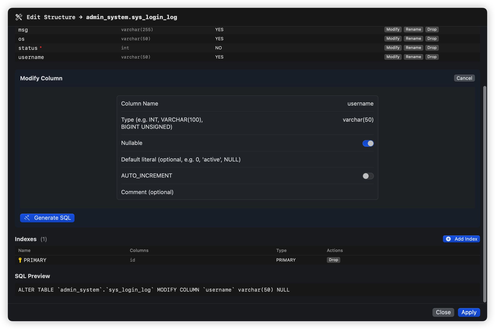
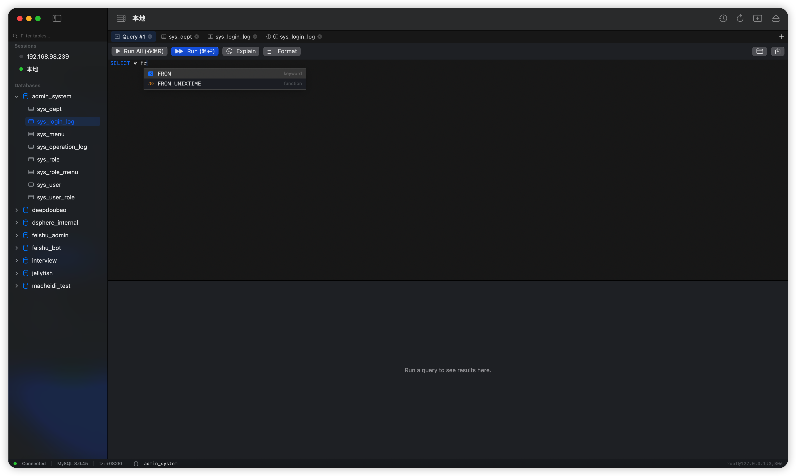
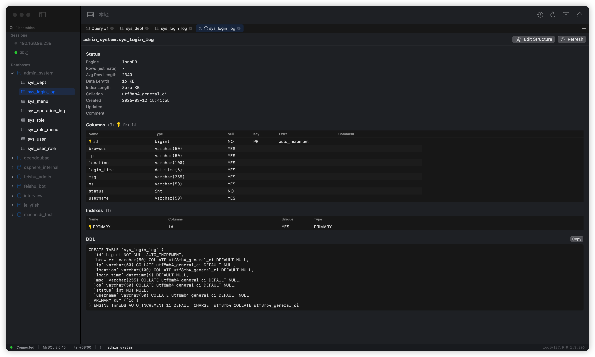
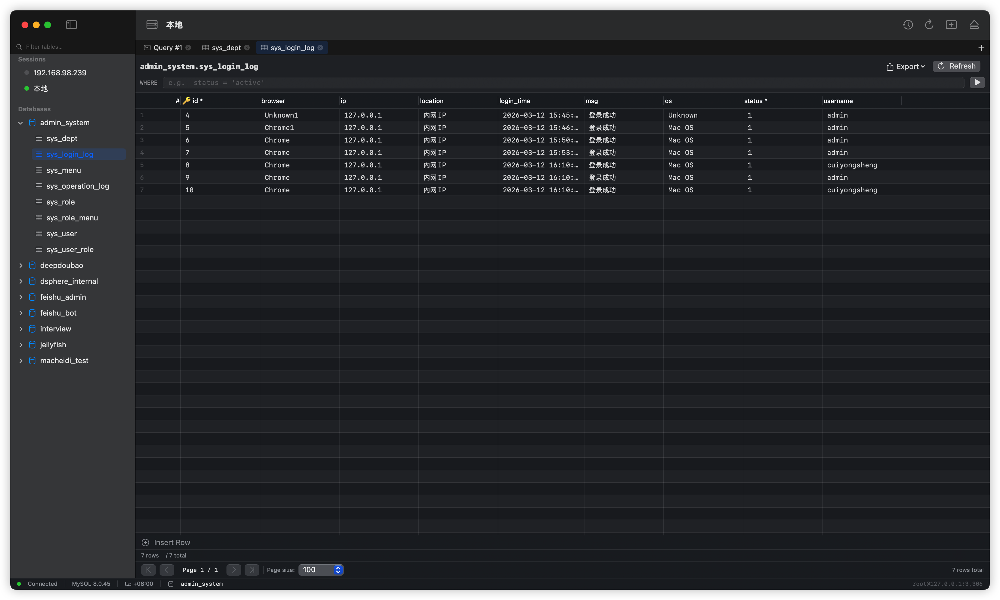
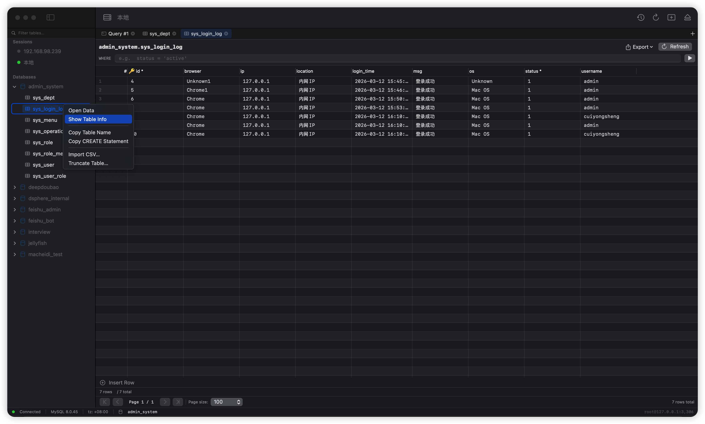
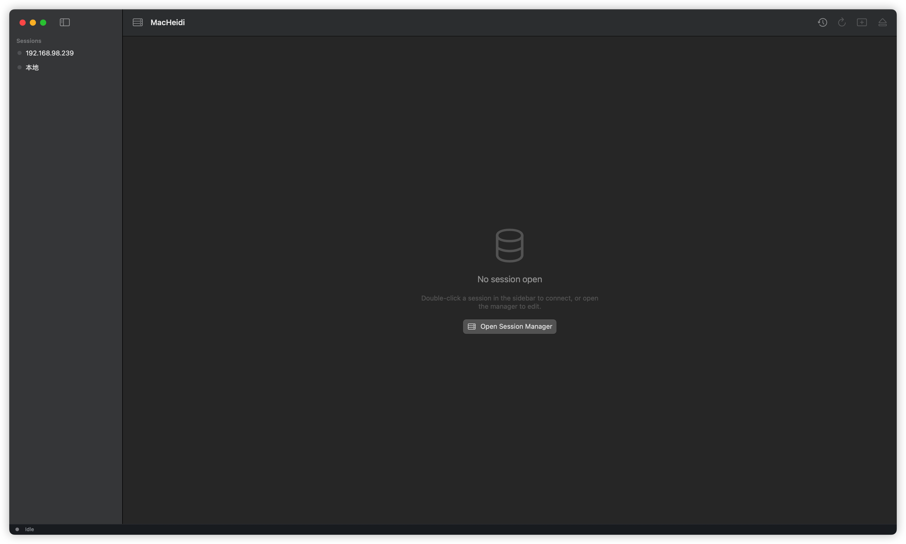
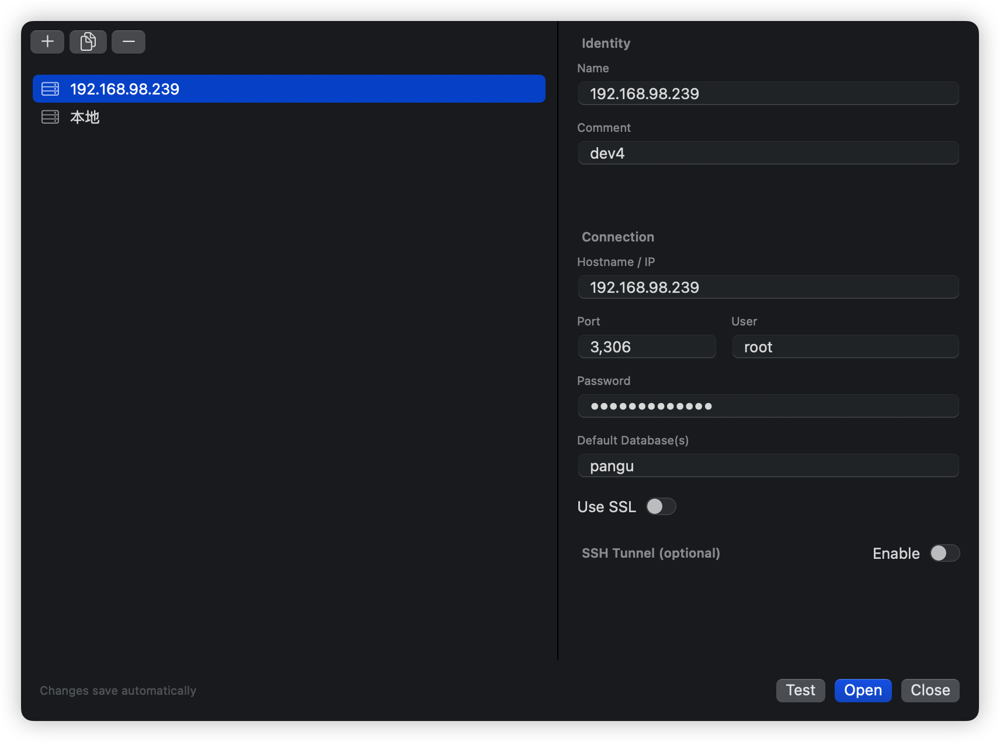
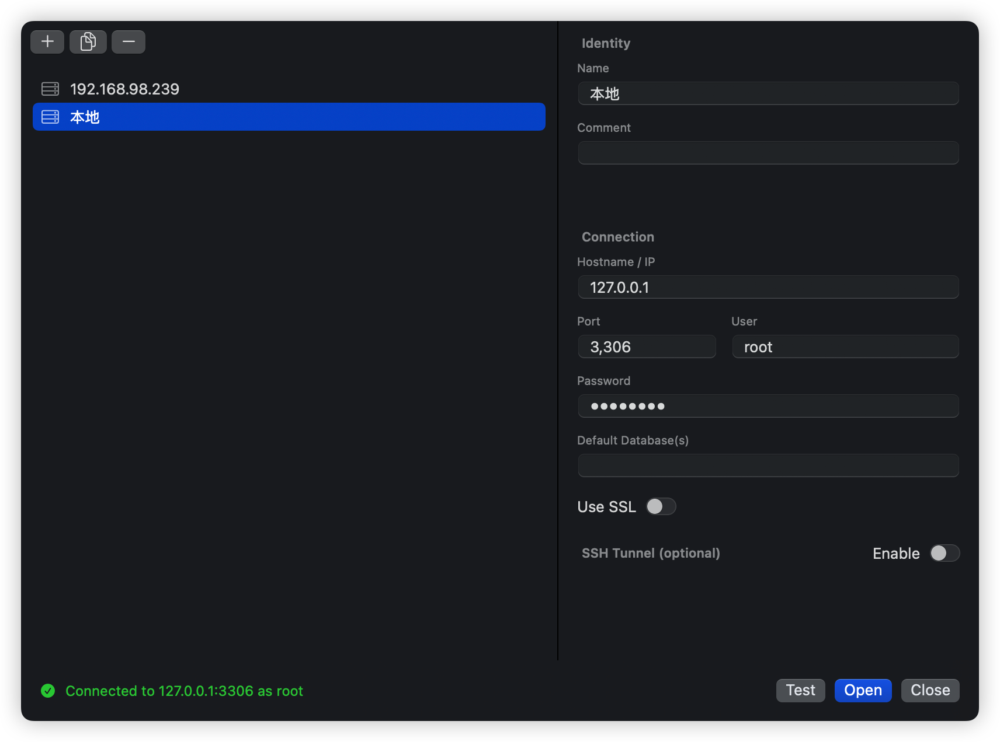
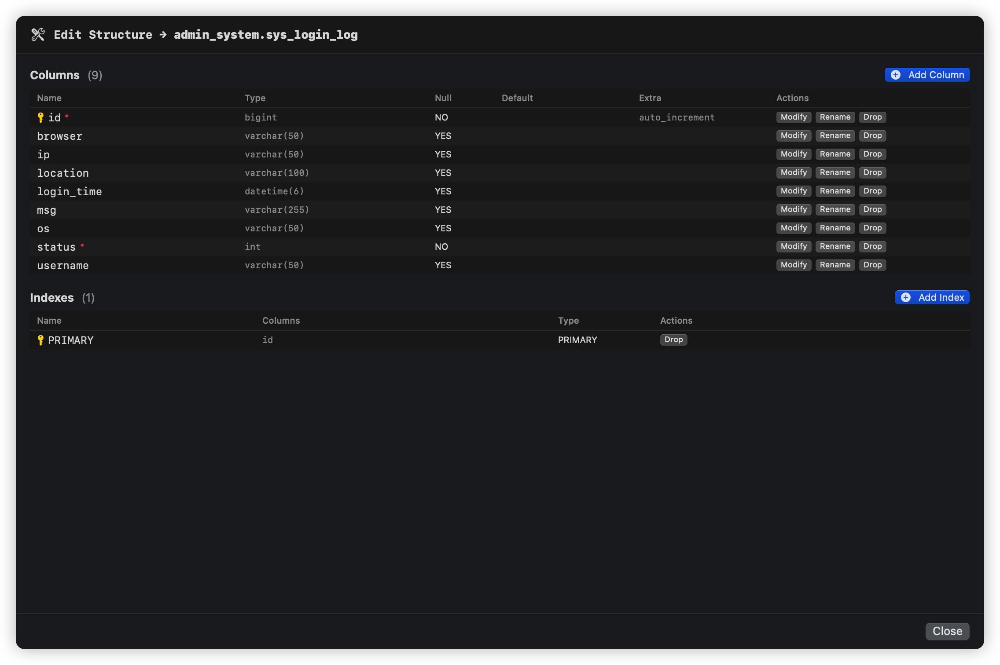

# MacHeidi

<p align="center">
  
</p>

<p align="center">
  <strong>Mac 上的 HeidiSQL —— 原生 SwiftUI 写的 MySQL 客户端。</strong><br>
  操作模型完全参考 HeidiSQL，视觉按 macOS 系统风格重新设计。
</p>

<p align="center">
  
  
  
  
  
  
  
</p>

---

**为什么写这个？** 我从 Windows 转到 Mac 之后一直怀念 HeidiSQL 的操作手感，但 Wine 里跑的 HeidiSQL 又卡又丑，TablePlus 收费、DBeaver 是 250MB 的 Java 程序、Sequel Ace 没有 SQL 自动补全。所以我用 SwiftUI + AppKit 写了一个原生的：**12 MB 安装包，1.5 秒冷启动，100 MB 空闲内存，跟系统主题走，操作路径跟 HeidiSQL 一样。**

**它能做什么？** 连 MySQL → 浏览数据库和表 → 改表结构（列 / 索引 / 外键）→ 写 SQL 加自动补全 → 改单元格批量提交（事务保证）→ 导入导出 CSV/SQL。**详见 [做了什么（功能详解）](#做了什么功能详解)**。

**它不做什么？** v0.1 只支持 MySQL（PostgreSQL 在路上）；不做 ER 图、不做服务器监控、不做数据同步。**详见 [没做什么](#没做什么)**。

## 下载

去 **[Releases 页面](https://github.com/Cuiys1458/myHeidiSql/releases)** 下 `MacHeidi-0.1.0.dmg`（13 MB）→ 拖进 Applications → **右键 → 打开**（首次启动绕过 Gatekeeper，因为没花 99 美金买 Apple Developer ID）。

或者自己编：

```bash
git clone https://github.com/Cuiys1458/myHeidiSql.git
cd myHeidiSql
./scripts/run.sh --debug          # 开发模式启动
./scripts/package.sh              # 出 .dmg
```

---

## 界面预览

<table>
  <tr>
    <td width="50%"></td>
    <td width="50%"></td>
  </tr>
  <tr>
    <td align="center"><sub>主界面 · 侧栏库表树 + Query Tab</sub></td>
    <td align="center"><sub>Data Tab · 分页 / WHERE / 列头 / 行头标记</sub></td>
  </tr>
  <tr>
    <td></td>
    <td></td>
  </tr>
  <tr>
    <td align="center"><sub>SQL 自动补全（输入即弹）</sub></td>
    <td align="center"><sub>表元信息 · Status / Columns / Indexes / DDL</sub></td>
  </tr>
  <tr>
    <td></td>
    <td></td>
  </tr>
  <tr>
    <td align="center"><sub>表结构编辑（DDL UI）· 列管理</sub></td>
    <td align="center"><sub>Modify Column · 改完即时生成 SQL Preview</sub></td>
  </tr>
</table>

---

## 目录

- [一句话定位](#一句话定位)
- [适合谁用 / 不适合谁用](#适合谁用--不适合谁用)
- [一分钟上手](#一分钟上手)
- [做了什么（功能详解）](#做了什么功能详解)
  - [1. 连接管理](#1-连接管理)
  - [2. 对象树（侧栏）](#2-对象树侧栏)
  - [3. 数据浏览（Data Tab）](#3-数据浏览data-tab)
  - [4. 表数据编辑](#4-表数据编辑)
  - [5. SQL 编辑器（Query Tab）](#5-sql-编辑器query-tab)
  - [6. SQL 自动补全](#6-sql-自动补全)
  - [7. 表元信息（Table Info）](#7-表元信息table-info)
  - [8. 表结构编辑（DDL UI）](#8-表结构编辑ddl-ui)
  - [9. 数据导入 / 导出](#9-数据导入--导出)
  - [10. 错误处理与诊断](#10-错误处理与诊断)
  - [11. 安全与持久化](#11-安全与持久化)
  - [12. 其他打底](#12-其他打底)
- [没做什么](#没做什么)
  - [暂未做（已规划）](#暂未做已规划)
  - [明确不做](#明确不做)
- [已知限制](#已知限制)
- [键盘快捷键速查](#键盘快捷键速查)
- [开发与构建](#开发与构建)
- [测试](#测试)
- [架构](#架构)
- [致谢](#致谢)

---

## 一句话定位

**Mac 上的 HeidiSQL 操作手感，没有 Wine 的别扭，没有 Electron 的笨重。**

| 维度 | MacHeidi | HeidiSQL (Wine) | TablePlus | DBeaver |
|---|---|---|---|---|
| 安装包 | **~12 MB** | ~30+ MB | 60+ MB | 250+ MB |
| 冷启动 | **~1.5s** | 慢 + Wine 启动 | ~1s | ~5s |
| 空闲内存 | **~100 MB** | ~150 MB | ~120 MB | 400 MB+ |
| 二进制 | Universal (arm64 + x86_64) | x86 only | Universal | JVM |
| 最低系统 | macOS 14 (Sonoma) | — | macOS 11 | macOS 10.15 |
| 协议 | 仅 MySQL（v0.1） | 多种 | 多种 | 多种 |

## 适合谁用 / 不适合谁用

**适合：**

- 从 Windows 转 Mac 的 HeidiSQL 老用户 —— 操作路径、肌肉记忆完全沿用
- Mac 上的 MySQL 日常使用者 —— 一个轻量、原生、不卡的客户端
- 受不了 Electron 内存占用、对启动时间敏感的工程师

**不适合：**

- 需要 PostgreSQL / SQLite / SQL Server / MongoDB 的（v0.1 仅 MySQL）
- 需要 ER 图、慢查询监控、跨库数据同步的（明确不做）
- 还在用 macOS 13 及更早系统的（用了 `@Observable` / `@Bindable`，需要 macOS 14+）

## 一分钟上手

```bash
git clone <repo> && cd my_mac_heidisql
./scripts/run.sh --debug          # 开发模式启动
# 或者出 dmg
./scripts/package.sh              # 产出 dist/MacHeidi-0.1.0.dmg
```

首次启动会自动弹 **Session Manager**：填 host / port / user / password / default database → Save → Connect。
密码立即写入 macOS Keychain，JSON 配置文件**永不**含明文密码。

---

## 做了什么（功能详解）

下面按子系统列出**已落地**的能力。每条后面的 PRD 锚点指向 `docs/PRD.md` 里的对应需求；每个子系统的 BDD 场景在 `features/*.feature`。

### 1. 连接管理

> 首次启动自动弹 Welcome 空态；点 **Open Session Manager** 进入会话管理，配 host / port / user / password，**Test** 验证后 **Open** 连进去。
>
> <table>
>   <tr>
>     <td></td>
>     <td></td>
>     <td></td>
>   </tr>
>   <tr>
>     <td align="center"><sub>无会话时的空态引导</sub></td>
>     <td align="center"><sub>Session Manager · 编辑远端会话</sub></td>
>     <td align="center"><sub>Test 成功后底部绿色反馈</sub></td>
>   </tr>
> </table>

**会话 CRUD**

- ✅ 新建 / 编辑 / 删除 / **复制**会话
- ✅ 删除会话需输入会话名做**二次确认**（防误删）
- ✅ 配置写到 `~/Library/Application Support/MacHeidi/sessions.json`
- ✅ JSON **原子写**（写 `.tmp` → `rename`） + 写前 `.bak` 备份；解析失败自动从 `.bak` 回退（PRD R9）

**密码与 Keychain**

- ✅ 密码**只存** macOS Keychain（Security.framework），JSON 永远不含明文
- ✅ Keychain **按需读取** —— 启动 / 列表展示时不读，避免每个会话都弹一次"始终允许"
- ✅ 重启后会话完整还原；连接时再去 Keychain 拿密码
- ✅ Keychain item 的 service / account 命名固定，重新打包后只在第一次连接时弹一次授权

**连接生命周期**

- ✅ 连接前置检查：必填字段 / 端口范围 / SSH 配置完整性
- ✅ 状态机：`disconnected → connecting → connected → disconnecting`，所有转移有测试覆盖（S5.1）
- ✅ **心跳调度** —— `HeartbeatScheduler` actor，30 秒一次 `SELECT 1`，失败即触发 `onDisconnect`
- ✅ **断线红色 Banner** —— 主窗顶部显示，含 **Reconnect** 按钮
- ✅ 区分**主动 disconnect** vs **被动断线**：主动断开不显示 banner

**SSH 隧道（基础版）**

- ✅ 基于系统 `ssh` CLI 的本地端口转发（`-L`）
- ✅ 配置项：jump host / port / user / 私钥路径 / passphrase
- ✅ 隧道与 DB 连接生命周期绑定，断开时一并清理
- ⚠️ 不内嵌 libssh2，依赖系统 `ssh` 与 `ssh-agent`

### 2. 对象树（侧栏）

> 
>
> 侧栏自动按 Sessions / Databases / Tables 分组；右键表得到 Open Data / Show Table Info / Copy Table Name / Copy CREATE Statement / Import CSV… / Truncate Table…

- ✅ 双层结构：**Sessions → Databases → Tables / Views / Procedures / Functions / Triggers**
- ✅ 不同对象类型按图标颜色区分
- ✅ **跨库表名搜索** —— `Filter tables…` 输入框，模糊匹配 / 大小写不敏感
- ✅ **Default Database 当白名单** —— 会话设置里逗号分隔多个库名，侧栏只显示这些（HeidiSQL 行为）
- ✅ **单击库** —— 自动 `USE <db>` + 展开 + 状态栏显示当前库
- ✅ **单击表** —— 直接打开 Data Tab（同时 USE 该库）
- ✅ **双击表** —— 等同单击
- ✅ **F5 / ⌘R** —— 刷新当前选中节点；粒度三档（Session / DB / Table）由 `RefreshPolicy` 决定
- ✅ 选中高亮（蓝色 accentColor）
- ✅ 右键菜单：
  - **表**：Open Data / Show Table Info / Copy Table Name / Copy CREATE Statement / Import CSV… / **Truncate Table…**
  - **会话**：Open / Edit / Duplicate / Delete

### 3. 数据浏览（Data Tab）

> 

**渲染与性能**

- ✅ **基于 NSTableView** 的 `EditableResultGrid` —— 百万行不卡（虚拟化 + 视图复用）
- ✅ **分页**：默认 100，下拉切 100 / 500 / 1000 / 5000
- ✅ **跳页输入框**：输入页号 → 回车跳转
- ✅ PageSize 偏好持久化（写 UserDefaults，重启保留）

**过滤与排序**

- ✅ **WHERE 输入栏**：裸 WHERE 子句，回车应用，语法错误以红字单独显示
- ✅ **MySQL warnings** 顶部黄条显示（已修「WHERE 隐式类型转换假阳性」）
- ✅ **列头排序**：点列头三态切换（升 → 降 → 取消），客户端排序

**列与单元格**

- ✅ **PK 🔑 + NOT NULL `*`** 列头标记
- ✅ **列宽拖拽 + 实时持久化**（KVO 监听，跨表保留）
- ✅ NULL 显示为灰色 `(NULL)`，与空字符串视觉区分
- ✅ **Cmd+C 复制**：选中行 → TSV 格式（含 header）写入剪贴板

**长查询控制**

- ✅ 加载时显示 **Cancel** 按钮 + ⌘. 中断
- ✅ Cancel 走 `KILL QUERY <connection_id>` —— 不杀连接

### 4. 表数据编辑

**编辑入口**

- ✅ **双击单元格** → 弹独立 sheet 窗口，多行 `TextEditor`
- ✅ "Set NULL" 按钮（仅 nullable 列可见）
- ✅ 类型校验失败 → 红框 + 错误说明
  - INT 拒绝 `"abc"`
  - NOT NULL 拒绝空值
  - DECIMAL 保精度（用 String 转，不走 Double）

**Pending 状态机**

- ✅ **多行批量挂起** —— 改多个单元格不立即提交，全部进 `PendingEdits`
- ✅ 行头标记：`●` 黄=修改 / `●−` 红=待删除 / `●+` 绿=待插入
- ✅ Pending 顶栏：`2 updates, 1 insert, 1 delete` + **Commit** / **Discard**
- ✅ INSERT 占位行：末尾 "Insert Row" 按钮 → 弹同样编辑窗
- ✅ 右键现有行 / 多选 → "Mark for Delete" / "Unmark Delete"
- ✅ 右键 insert 行 → "Discard This Insert"

**提交（数据安全核心，PRD §5.3.7）**

- ✅ **单事务 Commit**：`START TRANSACTION` → 多条 SQL → `COMMIT`，任一失败 `ROLLBACK`
- ✅ WHERE 全列匹配（NULL 用 `<=>` NULL-safe 比较）
- ✅ **无 PK 表 Commit 前**弹橙色二次确认（PRD §5.3.7.2 / R4）
- ✅ BLOB / TEXT 自动从 WHERE 排除；改这类列时拒绝提交（PRD §A）
- ✅ 编辑后状态栏显示具体 MySQL 错误，dirty 标记保留（不丢用户输入）

### 5. SQL 编辑器（Query Tab）

> 

- ✅ 多 Query Tab，互相独立；切换不丢 SQL（`AppEnvironment.queryTabSQL` 持久化）
- ✅ **F9 / ⇧⌘R**：执行所有语句 —— 由 `SQLSplitter` 状态机按 `;` 拆分（识别字符串 / 注释 / 反引号 / 转义）
- ✅ **⌘⏎**：执行光标所在的当前语句（同一份 splitter）
- ✅ **Cmd+. / Cancel** 按钮 + toolbar toast：中断长查询（`KILL QUERY`）
- ✅ **多 SELECT 多 sub-tab**：`Result #1` / `Result #2`…
- ✅ DML 结果在 Messages 面板：`X rows affected, Y ms`
- ✅ 错误高亮：MySQL 原文 + 红字 + errno
- ✅ **语法高亮**：关键字蓝 / 字符串红 / 注释灰 / 数字紫
- ✅ **打开 / 保存 .sql 文件**：⌘O / ⌘S
- ✅ **查询历史持久化**：⌘Y 打开浏览器，可搜索 / `Use This` 灌入新 Tab
- ✅ **EXPLAIN 按钮**：自动给当前语句加 `EXPLAIN ` 前缀执行
- ✅ **Format 按钮 / ⇧⌘F**：SQL 美化（关键字大写 + 主子句换行 + AND/OR 缩进；字符串内容保留原样）

### 6. SQL 自动补全

> 
>
> 输 `SELECT * fr` → 250ms 后自动弹出候选，关键字（蓝）和函数（紫）按图标分类，关键字优先于函数。

- ✅ **输入即弹**（IDE 风格，250ms debounce 之后无新输入触发）
- ✅ **⌃Space** 强制触发
- ✅ **↑↓** 选择 / **Enter / Tab** 确认 / **Esc** 关闭
- ✅ **上下文识别**（`CompletionEngine`）：
  - `FROM` / `JOIN` 后 → 提示**表名**
  - `WHERE` / `SET` / `ORDER BY` 后 → 提示**列名**
  - `users.` 这类 dotted 形式 → 该表的列
  - `SELECT` 后 → 列 + 函数
- ✅ 候选来源：62 个关键字 + 75 个内置函数（`VERSION` / `NOW` / `CONCAT` / `JSON_EXTRACT`…）+ 表名 + 列名
- ✅ 自定义弹窗（`NSPanel + NSTableView`），按图标分类着色
- ✅ 排序：完全匹配 > 前缀匹配 > 子串匹配
- ✅ Schema **增量加载** —— 不一次性拉全部库，避免侧栏被强制展开

### 7. 表元信息（Table Info）

右键表 → **Show Table Info** 打开独立窗口：

> 

- ✅ **Status**：Engine / Rows / Avg Row Length / Data Length / Index Length / Collation / Created / Updated / Comment
- ✅ **Columns**：完整列表（PK 🔑 / NOT NULL `*` / Type / Default / Comment）
- ✅ **Indexes**：PRIMARY 黄锁 / UNIQUE 蓝盾 / 普通 INDEX，列出索引列与方向
- ✅ **Foreign Keys**：约束名 → 引用 `referenced_db.table(col)` + ON DELETE/UPDATE
- ✅ **DDL**：完整 `SHOW CREATE TABLE` 语句 + Copy 按钮
- ✅ 顶部 **Edit Structure** 按钮 → 进入 DDL UI

### 8. 表结构编辑（DDL UI）

通过 Show Table Info → **Edit Structure** 进入 sheet：

> <table>
>   <tr>
>     <td></td>
>     <td></td>
>   </tr>
>   <tr>
>     <td align="center"><sub>列与索引一览，每行都有 Modify / Rename / Drop</sub></td>
>     <td align="center"><sub>改完字段后实时生成 SQL Preview，确认无误才 Apply</sub></td>
>   </tr>
> </table>

**列管理（A 子切片）**
- ✅ **Add Column**：Name / Type / Nullable / Default / AUTO_INCREMENT / PK / Position（FIRST / AFTER `<col>`） / Comment
- ✅ **Modify Column**：改类型 / 改 Nullable / 改默认值
- ✅ **Rename Column**：`CHANGE COLUMN`（同时可改类型）
- ✅ **Drop Column**：删除（PK 列删时给警告但不阻止）

**索引管理（B 子切片）**
- ✅ **Add Index**：填名 + 勾列（多选 = 复合索引）+ UNIQUE 开关
- ✅ **Drop Index**：每行 Drop 按钮（PRIMARY 自动转 `DROP PRIMARY KEY`）

**外键 + 表选项（C 子切片，核心层完成，UI 待补）**
- ✅ DDL Generator 已支持 `ADD CONSTRAINT … FOREIGN KEY … REFERENCES … ON DELETE … ON UPDATE`
- ✅ DDL Generator 已支持 `ENGINE=` / `DEFAULT CHARSET=` / `COLLATE=` / `COMMENT=`
- ✅ DDL Generator 已支持 `RENAME TABLE`
- ⚠️ **UI 入口未接** —— 仅核心层完成（11 个测试覆盖），见 [没做什么](#暂未做已规划)

**操作流程**
1. 选 / 填字段 → **Generate SQL** → 查看预览 + 警告
2. 点 **Apply** → 执行 ALTER TABLE
3. 成功后自动重载 schema 并刷新 Table Info

### 9. 数据导入 / 导出

#### 导出

- ✅ **Export 菜单**（Data Tab 顶部）：
  - **Current Page**：CSV / TSV / SQL（仅当前页 100 行）
  - **Entire Table**：CSV / TSV / SQL（**流式分批 SELECT**，每批 1000 行写盘，不会内存爆炸）
- ✅ 导出**跟随当前 WHERE 过滤**
- ✅ **RFC 4180** 规范：含逗号 / 引号 / 换行的字段自动包裹双引号 + 引号转义
- ✅ SQL 导出生成可重放的 `INSERT INTO …` 语句
- ✅ 进度条 + 完成提示

#### 导入

- ✅ 右键表 → **Import CSV…**
- ✅ 文件选择 → 自动解析前 20 行预览
- ✅ Separator 切换：`,` / `\t` / `;` / `|`
- ✅ "First row is header" 开关
- ✅ **列映射表**（CSV 列 ↔ 表列，自动猜同名）
- ✅ 缺 NOT NULL 列时给警告（不阻止，让用户决定 default 处理）
- ✅ **单事务批量 INSERT**（每批 500 行），失败 ROLLBACK
- ✅ 进度条 + 行数统计

### 10. 错误处理与诊断

`MacHeidiCore` 提供统一的 `DBError` 抽象，把 MySQL errno 映射到 5 个语义类别（PRD §5.5.4，13 个 errno 已映射）：

| 类别 | 触发条件示例 | UI 表现 |
|---|---|---|
| `network` | 连不上 / 半路断 / 心跳失败 | 红色 banner + Reconnect |
| `auth` | errno 1045 / 1044 | Session Manager 高亮密码字段 |
| `syntax` | errno 1064 / 1146 | 错误面板 + 行列号 |
| `constraint` | errno 1062 / 1452 / 1451（FK / 唯一键） | Data Tab pending bar 显示具体冲突 |
| `timeout` | 连接 timeout / Cancel 触发 | 状态栏黄条 |

15 个错误归一化测试覆盖在 `S5.4_error_normalization.feature`。

### 11. 安全与持久化

- ✅ 密码只存 Keychain，JSON 不写明文（PRD §5.1）
- ✅ JSON 原子写 + .bak 回退（PRD R9）
- ✅ 删除会话二次确认（输入名字才能删）
- ✅ Truncate / 无 PK 提交 二次确认（PRD §5.3.7.2）
- ✅ BLOB / TEXT WHERE 安全：自动排除以避免误改批量数据
- ✅ 长查询 Cancel 走 KILL QUERY（不杀连接，不影响其他 tab）
- ✅ DDL 操作前展示完整 SQL 预览

### 12. 其他打底

- ✅ **首次启动自动弹** Session Manager
- ✅ **Welcome 空态**（无会话时大按钮 "New Connection…"）
- ✅ **状态栏**：连接圆点 / MySQL 版本 / 时区 / `🛢 当前库` / `user@host:port`
- ✅ **App 图标**（蓝色渐变 + 三层数据库圆柱 + 绿色 S 形藤蔓 + 散落叶子，1024 → 16 全套尺寸）
- ✅ **Universal Binary**（arm64 + x86_64）
- ✅ `.dmg` 一键打包脚本：`./scripts/package.sh`
- ✅ **i18n 框架**：`Localizable.strings` 已建中英文资源 bundle，待全量替换硬编码

---

## 没做什么

诚实分两类：**暂未做（已规划，会做）** 和 **明确不做（与定位冲突）**。

### 暂未做（已规划）

按工作量排序：

#### 立刻能做的小补丁（< 1 天）

| 项 | 工作量 | 说明 |
|---|---|---|
| ⚠️ DDL 外键 / 表选项 UI 入口 | 1–2 h | 核心层 + 测试已完成，等接 UI |
| ⚠️ i18n 全量字符串切换 | 1–2 h | strings 文件已建好，代码里仍是英文硬编码 |
| 复制单元格作为 INSERT 语句 | 0.5 h | 右键菜单加一项 |
| 行 hover 高亮（NSTableView） | 0.5 d | mouse tracking |
| 编辑 sheet → Tab 跨单元格导航 | 0.5 d | 改成 inline 编辑后才有意义 |
| 批量编辑（多选行同列改） | 0.5 d | UI + PendingEdits 已就绪 |
| 侧栏会话拖拽排序 | 0.5 d | |
| 会话颜色 / Tag（区分 prod / staging） | 0.5 d | 防误连生产 |
| JSON 列专用编辑器（语法高亮 + Format） | 0.5 d | |
| 自定义键位 | 0.5 d | |

#### 中等工作量（1–2 天）

| 项 | 工作量 | 说明 |
|---|---|---|
| 多窗口同 Session | 1 d | 现在一个 Session 一个窗 |
| EXPLAIN 可视化（树形渲染） | 1 d | 现仅文本输出 |
| 结果集 → 图表（柱图 / 折线 / 饼图） | 2 d | |

#### 较大投入（3 天起）

| 项 | 工作量 | 说明 |
|---|---|---|
| ❌ **PostgreSQL 适配** | 3–5 d | 新增 driver 模块（`MacHeidiPostgres`） + 类型差异处理 |
| 服务器变量 / 进程列表面板 | 2 d | 类似 HeidiSQL 的 Status / Variables |
| 用户与权限管理界面 | 3 d | GRANT / REVOKE / SHOW GRANTS UI |
| 触发器 / 存储过程编辑器 | 3 d | 现仅在侧栏列出，无编辑 |
| 数据生成器（fake data） | 2 d | |

### 明确不做

| 项 | 原因 |
|---|---|
| ❌ Mac App Store 上架 | 用户明确不需要 |
| ❌ Apple Developer ID 签名 + Notarization | 用户明确不需要（同事走"右键 → 打开"） |
| ❌ Sparkle 自动更新 | 用户明确不需要 |
| ❌ Crash 上报后端 | 用户明确不需要 |
| ❌ ER 图工具 | 与定位冲突，市场已饱和（Workbench / DBeaver） |
| ❌ 服务器监控 / 慢查询图表 | 不是客户端的事 |
| ❌ 数据同步 / 迁移工具 | 与"客户端"定位冲突 |
| ❌ ORM / 代码生成器 | 越界 |
| ❌ 内嵌 libssh2（替换系统 ssh） | 复杂度收益不成正比，依赖 ssh-agent 完全够用 |

---

## 已知限制

| 项 | 说明 | 影响 |
|---|---|---|
| **Ad-hoc 签名** | 同事第一次打开需"右键 → 打开"绕过 Gatekeeper | 一次性 |
| **Keychain 授权** | 重新编译 / 重打包后第一次连接弹一次"始终允许" | 一次性 |
| **MySQL 5.7 caching_sha2_password** | 已验证 MySQL 8 工作；5.7 用户密码若用新插件未实测 | 老库可能踩坑 |
| **大 BLOB / GEOMETRY 列** | 只读显示 `[BLOB N bytes]`，不能编辑（PRD §A） | 这类列改不动 |
| **超大 CSV 导入** | 一次性进内存（>500 MB 文件不建议） | 建议 split 后导 |
| **大结果集** | SELECT 默认 100 行/页；想看全部用 Export All | 不影响日常 |
| **macOS 14 最低** | 用了 `@Observable` / `@Bindable` 需要 macOS 14+ | 老系统装不上 |
| **F9 触发** | macOS 默认 F9 被 Mission Control 占用 | 在系统设置改 fn 行为，或用 ⇧⌘R |
| **SSH 隧道依赖系统 ssh** | 没装 `openssh-client` 或 ssh-agent 不工作 | macOS 自带，正常机器没事 |
| **单一协议** | v0.1 仅 MySQL；PostgreSQL / SQLite 等待 v0.4 | 多库用户先用别的工具 |

---

## 键盘快捷键速查

### 全局

| 快捷键 | 行为 |
|---|---|
| ⌘⇧S | 打开 Session Manager |
| ⌘T | 新建 Query Tab |
| ⌘W | 关闭当前 Tab |
| ⌘R / F5 | 刷新当前节点 |
| ⌘Y | 查询历史浏览器 |
| ⌘. | 取消当前查询（KILL QUERY） |

### Query Tab

| 快捷键 | 行为 |
|---|---|
| ⌘⏎ | 执行光标所在当前语句 |
| ⇧⌘R / F9 | 执行全部语句 |
| ⇧⌘F | 格式化 SQL |
| ⌘O | 打开 .sql 文件 |
| ⌘S | 保存 .sql 文件 |
| ⌃Space | 强制触发自动补全 |
| ↑ ↓ | 在补全弹窗里上下选 |
| Enter / Tab | 确认补全 |
| Esc | 关闭补全弹窗 |

### Data Tab

| 快捷键 | 行为 |
|---|---|
| ⌘R | 刷新当前页 |
| ⌘C | 复制选中行（TSV 含 header） |
| Delete | 标记选中行为待删除 |
| Double-Click | 进入单元格编辑 |

---

## 开发与构建

```bash
# 开发模式启动
./scripts/run.sh --debug

# 跑测试（核心 246 个，跳过需要 MySQL 的集成测试）
swift test --skip MacHeidiMySQLTests

# 跑包含真实 MySQL 集成测试的全套
# 需要本地 MySQL 跑在 127.0.0.1:3306, root/password
swift test

# 出 .dmg
./scripts/package.sh

# 重新生成 App 图标
./scripts/make-icon.sh
```

构建产物写到 `dist/`：

| 文件 | 说明 |
|---|---|
| `dist/MacHeidi.app` | 可直接运行的 .app bundle |
| `dist/MacHeidi-0.1.0.dmg` | 12 MB，可发同事 |
| `dist/AppIcon.icns` | 应用图标（多尺寸） |
| `dist/icon-1024.png` | 图标预览 |

依赖：

- [vapor/mysql-nio](https://github.com/vapor/mysql-nio) `1.7+` —— 唯一外部依赖
- swift-testing（Swift 6 自带）
- AppKit / SwiftUI（macOS 自带）

---

## 测试

```
✔ Test run with 246 tests passed
```

测试分布：

| Suite | 数量 | 内容 |
|---|---:|---|
| S5.4 Error Normalization | 15 | MySQL errno → DBError 映射 |
| S5.1 DBClient Contract | 13 | 协议状态机 + Mock |
| S1 Session Persistence | 20 | JSON 原子写 + .bak 回退 + Keychain 隔离 |
| S5.2 MySQL Integration | 8 | 真实 MySQL 8 集成（auth / cancel / KILL QUERY） |
| DatabaseFilter | 8 | Default Database 白名单 |
| SQLIdentifier | 7 | 标识符转义 |
| SessionDeletionPolicy | 3 | 删除前置检查 |
| HeartbeatScheduler | 3 | 心跳 + onDisconnect |
| RefreshPolicy | 5 | F5 刷新粒度 |
| SQLSplitter | 21 | SQL 状态机拆分 |
| SQLExecutor | 5 | 多语句执行 |
| Pagination | 16 | 分页计算（边界 + 总数未知） |
| ResultExporter | 4 | CSV / TSV / SQL |
| QueryHistory | 3 | 历史持久化 |
| UserPreferences | 5 | UserDefaults 包装 |
| CSVParser | 10 | RFC 4180 |
| CompletionEngine | 12 | 上下文判断 + 排序 |
| CompletionTrigger | 13 | 输入即弹状态机 |
| DDLGenerator (columns) | 15 | ADD/DROP/MODIFY/CHANGE |
| DDLGenerator (indexes) | 11 | ADD/DROP INDEX |
| DDLGenerator (foreign keys) | 11 | ADD/DROP FK + 表选项 |
| SQLFormatter | 9 | 关键字大写 + 缩进 + 字符串保留 |
| CellValueParser / PendingEdits / SQLGenerator | 31 | 行编辑核心 |

BDD 场景见 `features/*.feature`（13 个 .feature 文件，≈ 1290 行 Gherkin）。

---

## 架构

```
MacHeidi.app
└── 进程
    ├── MacHeidiCore (纯逻辑层 / 100% 单元测试覆盖)
    │   ├── DBClient protocol     ← 上层只依赖这个
    │   ├── DBError + 归一化 (5 类，13 个 errno 映射)
    │   ├── ConnectionConfig
    │   ├── ResultSet / ColumnMeta / CellValue
    │   ├── SessionConfig (Codable)
    │   ├── SessionStore (JSON / InMemory)
    │   ├── SessionManager
    │   ├── KeychainStore protocol + MockKeychainStore
    │   ├── MockDBClient (actor)
    │   ├── DatabaseFilter (白名单)
    │   ├── SQLSplitter (状态机)
    │   ├── SQLGenerator (UPDATE / INSERT / DELETE / literal)
    │   ├── SQLIdentifier (反引号转义)
    │   ├── SessionDeletionPolicy
    │   ├── RefreshPolicy
    │   ├── HeartbeatScheduler (actor)
    │   ├── Pagination (值类型)
    │   ├── UserPreferences (UserDefaults 包装)
    │   ├── ResultExporter (CSV / TSV / SQL 流式)
    │   ├── QueryHistory
    │   ├── CSVParser (RFC 4180)
    │   ├── CompletionEngine + CompletionTrigger
    │   ├── DDLGenerator (列 / 索引 / 外键 / 表选项)
    │   ├── SQLFormatter (关键字大写 + 缩进)
    │   ├── CellValueParser (类型校验)
    │   ├── PendingEdits (dirty 状态机)
    │   ├── TableSchema / IndexMeta
    │   └── MacOSKeychainStore (Security.framework 桥接)
    │
    ├── MacHeidiMySQL (Driver 适配层)
    │   ├── MySQLClient (DBClient 实现，actor)
    │   └── MySQLErrorMapping (MySQLError → DBError)
    │
    └── MacHeidiApp (UI / SwiftUI)
        ├── AppEnvironment (@Observable，单例 ViewModel)
        ├── DataTabViewModel (@Observable)
        ├── CSVImportViewModel (@Observable)
        ├── SSHTunnel (基于 ssh CLI)
        ├── MySQLClientFactory
        ├── Views/
        │   ├── RootView
        │   ├── SidebarView (含表名搜索)
        │   ├── SessionManagerView
        │   ├── DataTabView
        │   ├── EditableResultGrid (NSTableView 高性能版)
        │   ├── QueryTabView
        │   ├── SQLEditor (NSTextView 子类 + 补全)
        │   ├── CompletionPopup (NSPanel 自定义弹窗)
        │   ├── ResultGrid (只读)
        │   ├── TabBarView
        │   ├── TableInfoView
        │   ├── EditTableSchemaView (DDL UI)
        │   ├── CSVImportView
        │   └── QueryHistoryView
        └── 资源
            ├── en.lproj/Localizable.strings
            └── zh-Hans.lproj/Localizable.strings
```

**分层原则**

- `MacHeidiCore` 不依赖 AppKit / MySQL —— 纯 Swift，可在 Linux 跑（理论上）
- `MacHeidiMySQL` 唯一依赖外部 driver
- `MacHeidiApp` 唯一依赖 AppKit / SwiftUI

UI 想换协议 → 只换 driver target；测试想跑 → 只测 Core，不需要起 MySQL。

---

## 许可证

MacHeidi 采用 **[PolyForm Noncommercial 1.0.0](LICENSE)** 许可证 —— **免费供非商业使用**。

| 用途 | 是否允许 |
|---|---|
| 个人使用、学习、研究、爱好项目 | ✅ |
| 学术机构、慈善组织、政府部门、公共研究机构使用 | ✅ |
| 修改源代码并自用 | ✅ |
| 重新分发（带原始 license 和版权声明） | ✅ |
| **任何商业用途** —— 包括公司内部生产使用、嵌入付费产品、做成 SaaS 收费、二次销售 | ❌ |

需要商用授权？请到 [Issues](https://github.com/Cuiys1458/myHeidiSql/issues) 联系作者另谈。

> 上表是通俗说明，**法律效力以 [LICENSE](LICENSE) 文件中的英文条款为准**。如果两者冲突，以 LICENSE 文件为准。

---

## 致谢

- **HeidiSQL** —— 灵感来源，操作模型完全对齐
- **vapor/mysql-nio** —— Swift 原生 MySQL 驱动（Apache 2.0）
- **Apple SwiftUI / AppKit** —— UI 框架

---

_v0.1 · 246 unit tests passing · 12 MB Universal Binary · macOS 14+_
